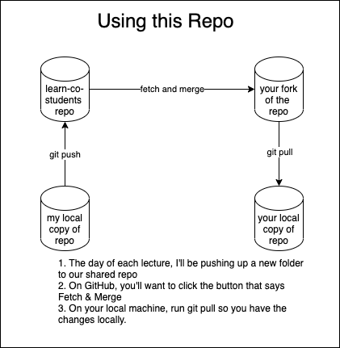

# SENG-LIVE-121321-phase-1

## How to use this repository

## Todo On Day 1
- Fork the repository
- Once the fork is complete, clone your fork locally by clicking the Green Code button, selecting the SSH option and clicking the clipboard icon to copy the url to your clipboard.
- Go to VSCode and open up the attached terminal, navigate to the directory where you want to store your code locally (using the cd command)
- Run git clone <paste git repo url here>
- Run code <name of git repo folder here>
    - This will open a new VSCode window with your local copy of the lecture repository
- Run `git remote -v` in your terminal for the new VSCode window
    - You should see a git url pointing to your fork of the lecture repo
- Add a remote pointing to the upstream lecture repository that you forked from
    - Go back to Github.com and click on the link to the original repo that you forked.
    - Again click on the green code button and get the SSH link for the repo there.
    - Git remote add upstream <original repo git url here>
    - We’re doing this so that before each lecture you’ll be able to fetch the changes that your lecturer has added to the repo for that day’s lecture.
    - Verify that it worked by running git remote -v again
    - You should now see origin twice and upstream twice below that with urls starting with `git@github.com` The upstream url should be to the original repository, whereas origin will point to your fork.

## Todo Before Subsequent Lectures
- To demonstrate, I’m going to create a new file in the original repository on my machine to simulate a lecturer adding the starter code for a new lecture.
    - I’ll need to add the change and make a commit and then push it up to the original remote (which will be the upstream for you as a student working on your machine)
    - You can see here that when I reload the original repo in the browser, the new file has been added.
- As a student, you’ll mostly be interacting with your fork of the repo. If you’re coding along on your machine, you’ll want to make sure that you use git in such a way that your changes won’t interfere with mine. So, you have a couple of choices about you can do before lecture.
    - The simplest thing to do is to use the `git stash` command to stash your changes in the local copy of your fork of the repo (not on GitHub)
    - The other choice is to create a branch for your own code (that you can put on GitHub) and always code on a branch separate from the one where the starter code lives. This is more similar to your actual git workflow on a project that you’re collaborating on, but involves a few more steps.
- For the simpler setup with `git stash`, what you’ll be doing before each new lecture begins is:
    - Running `git stash` to store your work within the repository without affecting any existing branches. A stash is like a commit that isn’t stored in a branch. So, when you run the stash, your work will be committed to the stash, removing it from your working directory. This will allow you to pull down code from the upstream repo without overwriting your own work (because you stashed it in your local repository before hand)
    - Running `git pull upstream main` to pull the changes from the original (upstream) repo to your local copy.
- For the more robust approach, there’s a bit additional setup that you only need to do once, and then a few more steps that you’ll complete every day.
- For setup (only once) you’ll create a branch where you’ll save your own code
    - `git checkout -b my_code`
    - Always write your code on the my_code branch. You can check your current branch by running `git branch` in your terminal. If you see *main instead of *my_code and you’ve already made some changes:
        - Run `git stash`
        - Then `git checkout my_code`
        - And finally `git stash pop`
            - The stash pop will take the stashed changes out of the stash and put them back into the working directory on the branch you’ve checked out (my_code) 
            - NOTE: This is only necessary if you’re checking out an already existing branch. If you realize that you want to store the current changes in your working directory in a new branch, you can run `git checkout -b new_branch_name` without having to stash changes first. So, if you don’t see my_code in the list of branches when you run `git branch` you can check it out and create it at the same time with the following command: `git checkout -b my_code`
- Then, every other day after the initial setup is complete, you’ll do the following:
    - Make sure you’ve committed any changes you’ve made to the my_code branch in previous lectures
        - `git add .`
        - `git commit -m “my code from lesson 1”
    - Checkout (switch to) the main branch:
        - `git checkout main`
    - Pull down new lecture added by lecturer
        - `git pull upstream main`
    - Switch to your branch again
        - `git checkout my_code`
    - Merge the changes to main (the addition of the next lecture) into your my_code branch:
        - `git merge main`
- At that point, you’ll have the starter code within the my_code branch and you’ll still be able to refer to the code you wrote during previous lectures.
